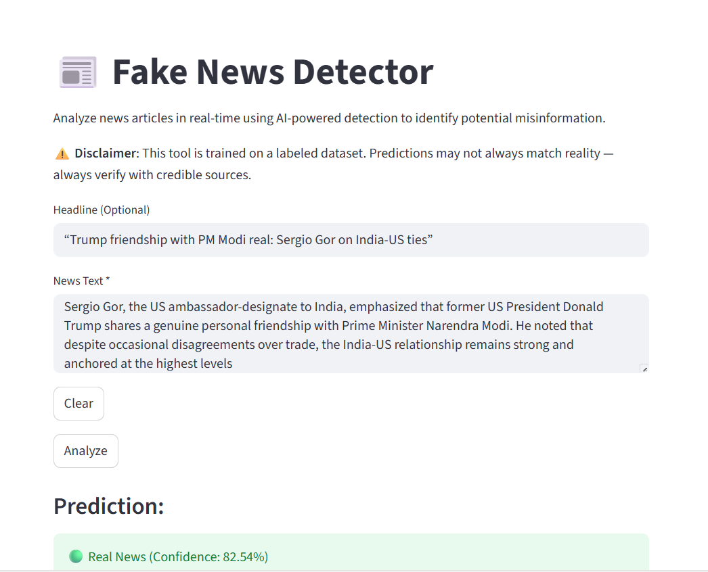

# Fake News Detector

A machine learning app that classifies news articles as **real or fake** using a DistilBERT model.  
Built with **Python, Streamlit, and Hugging Face Transformers**.

---

## 🚀 Features
- Classifies news as real or fake
- Shows confidence score for predictions
- Simple Streamlit UI for easy use

---

## 📦 Installation
Clone the repo and install dependencies:
```bash
git clone https://github.com/RamaKumar-Chennai/Fake_news.git
cd Fake_news
pip install -r requirements.txt

## 🖼 Demo

